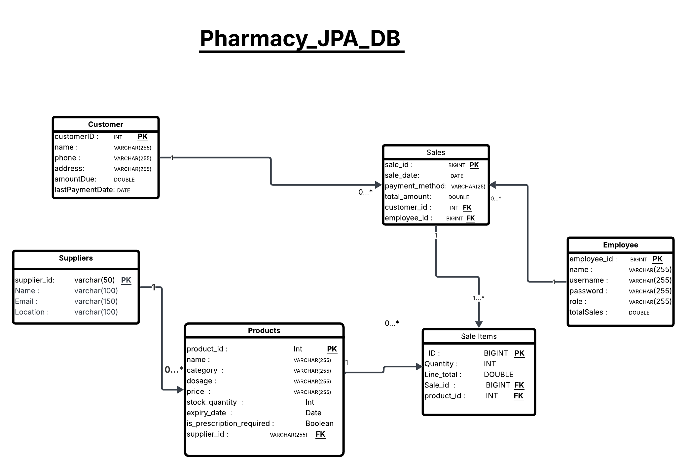

# 💊 Pharmacy Management System

A desktop-based Pharmacy Management System built with **Java Swing** and **JPA (Jakarta Persistence API)** for database management.

---

## 🗄️ Database Schema



---

## 🚀 Features

- 👨‍💼 **Employee Management** — Add, delete, and manage pharmacy staff with login authentication
- 👤 **Customer Management** — Track customers, contact info, and outstanding debt
- 💊 **Product Management** — Manage medicines and products with stock, pricing, expiry, and supplier info
- 🧾 **Sales Management** — Record sales with cash, credit, or deferred (آجل) payment
- 💰 **Debt Tracking** — Pay off customer debts with real-time balance updates
- 🏭 **Supplier Management** — Link products to suppliers with contact details
- 📊 **Advanced Queries** — 7 built-in reports covering sales, performance, stock alerts, and more

---

## 🛠️ Tech Stack

| Layer | Technology |
|---|---|
| Language | Java 17+ |
| UI | Java Swing |
| Persistence | Jakarta JPA (Hibernate) |
| Database | MySQL |
| Build Tool | Maven / NetBeans |

---

## 📊 Database Tables

| Table | Description |
|---|---|
| `customers` | Customer info + amount due |
| `employees` | Staff accounts + total sales |
| `products` | Medicine & product inventory |
| `suppliers` | Supplier contact info |
| `sales` | Sale transactions |
| `sale_items` | Line items per sale |

---

## 📋 Query Reports

| # | Report |
|---|---|
| Q1 | Products & their Suppliers |
| Q2 | Sales with Employee & Customer details |
| Q3 | Sale Items with Customer & Product |
| Q4 | Employee Performance & Revenue |
| Q5 | Customers with Debt & Last Purchase |
| Q6 | Low Stock Products (≤ 10 units) + Supplier |
| Q7 | Top Sold Products & Who Sold Them |

---

## ⚙️ Setup

1. **Clone the repository**
```bash
git clone https://github.com/mayerzakaria/pharmacy-system.git
```

2. **Create the database**
```sql
CREATE DATABASE Pharmacy_dB;
```

3. **Configure `persistence.xml`**
```xml
<property name="jakarta.persistence.jdbc.url" 
          value="jdbc:mysql://localhost:3306/Pharmacy_JPA_DB"/>
<property name="jakarta.persistence.jdbc.user" value="root"/>
<property name="jakarta.persistence.jdbc.password" value="your_password"/>
```

4. **Run the project** from NetBeans or your IDE of choice

---

## 🔐 Login

The system requires employee credentials to log in. Add the first employee directly via the database or seed script.

---

## 📁 Project Structure

```
pharmacy.system/
├── MainGUI.java          # Main dashboard (Swing UI)
├── LoginFrame.java       # Login screen
├── PharmacyDAO.java      # All database operations (JPA)
├── Employee.java         # Entity
├── Customer.java         # Entity
├── Product.java          # Entity
├── Supplier.java         # Entity
├── Sale.java             # Entity
└── SaleItem.java         # Entity
```

---

## 👨‍💻 Author
Mayer Zakaria 

